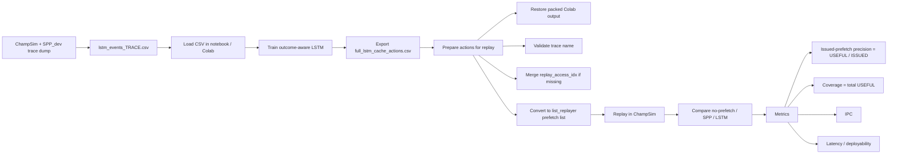
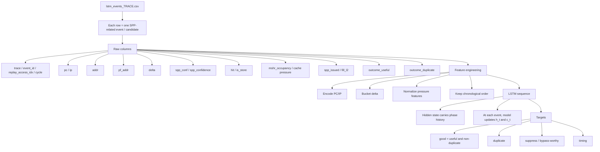
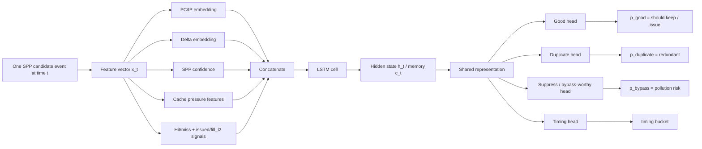
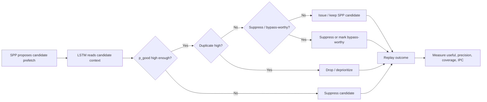
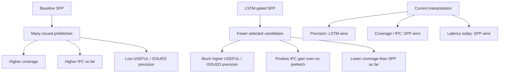
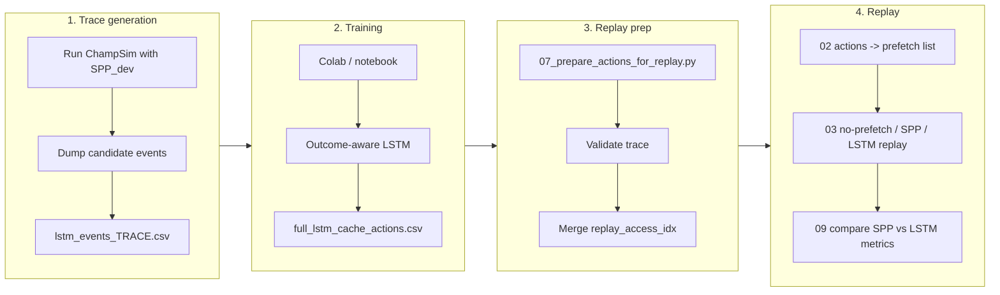

# LSTM Cache-Action Predictor Pipeline Story

This note explains the current LSTM-based cache-action learning flow as a story. It is meant to be easier to read than the main README and to match the diagrams used when explaining the project.

For exact numbers and the SPP-vs-LSTM metric table, use:

```text
formal_NN_training/README_LSTM_cache_action_predictor.md
```

## 0. One-sentence summary

```text
SPP proposes many candidate prefetches; the LSTM reads each candidate plus cache context over time and learns a cleaner keep/drop policy.
```

This is **not** direct next-address prediction as the final story. The useful framing is:

```text
SPP = candidate generator + feature/context provider + supervision source
LSTM = sequential cache-action learner / candidate utility selector
Replay = system-level validation in ChampSim
```

## 1. End-to-end project flow



## 2. What one row means

Each row in `lstm_events_TRACE.csv` represents one SPP-related candidate event. It is not just an address. It includes the current demand context, the candidate prefetch address, and outcome labels.



The replay-critical field is `replay_access_idx`, not `event_id`. The prefetch list must use:

```text
replay_access_idx 0xprefetch_byte_addr
```

If conversion prints `[idx_col] event_id`, the replay is invalid.

## 3. Model architecture

At every time step `t`, the model reads one SPP candidate event.



## 4. What the LSTM memory means for cache behavior

The LSTM is learning phase-sensitive behavior:

```text
same PC + same delta may be useful in one phase but harmful in another phase
cache pressure changes the value of issuing a candidate
recent duplicate/useful history changes whether a new candidate should be trusted
```

In cache terms, the gates mean:

```text
forget gate: old access phase may no longer matter
input gate: current candidate may define a new useful pattern
output gate: memory decides how much to trust the current candidate
```

## 5. Runtime decision logic



Current implementation is replay-based, not yet an online hardware deployment. Current replay mainly validates keep/drop prefetch decisions; bypass and timing are auxiliary signals for later online policies.

## 6. Baseline SPP vs LSTM-gated SPP



## 7. Current results: 602 and 619

All results use 25M warmup / 25M simulation.

| Trace | Method | IPC | Useful / Issued | Total Useful | Conclusion |
|---|---|---:|---:|---:|---|
| 602.gcc_s-734B | SPP | 1.4440 | 5.14% | 140,717 | best IPC / coverage |
| 602.gcc_s-734B | LSTM th0.20 | 0.7175 | 57.34% | 64,473 | much cleaner selector |
| 619.lbm_s-4268B | SPP | 0.5077 | 3.42% | 88,474 | best IPC |
| 619.lbm_s-4268B | LSTM th0.10-th0.35 | 0.4568 | 94.79% | 157,564 | extremely high precision, positive IPC over no-prefetch |

Current checkpoint:

```text
Across both traces, LSTM wins issued-prefetch precision.
SPP still wins final IPC.
The research opportunity is to keep LSTM precision while increasing coverage, or distill the policy into a low-latency hardware-feasible gate.
```

## 8. Final overview



## 9. What to say in a meeting

```text
I used SPP as a candidate generator and trained a stateful LSTM to learn which SPP candidates are useful, duplicate, bypass-worthy, or timing-sensitive. The key replay bug was alignment: ChampSim list_replayer needs L2 demand-access indices and hexadecimal byte addresses. After fixing that, LSTM replay is valid on both gcc and lbm. On 602, LSTM improves IPC from 0.5427 to 0.7175 and raises useful/issued precision from SPP's 5.14% to 57.34%. On 619, LSTM reaches 94.79% useful/issued precision and improves over no-prefetch, but SPP still has higher final IPC. So the current story is: LSTM is a much cleaner selector, while SPP still wins coverage and performance.
```
