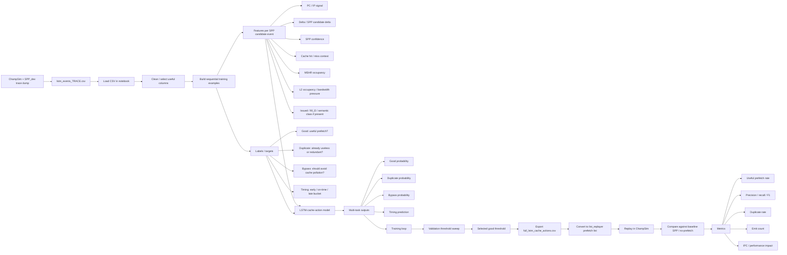
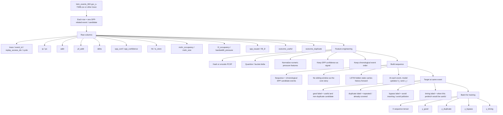
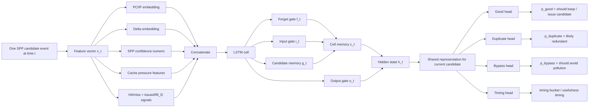
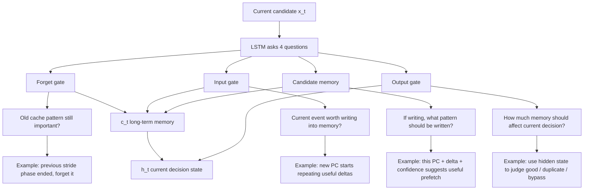
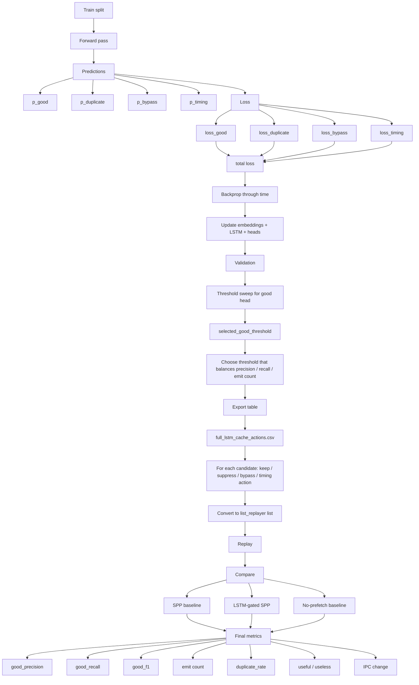
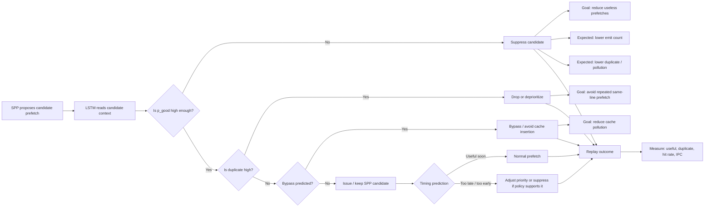
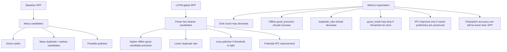
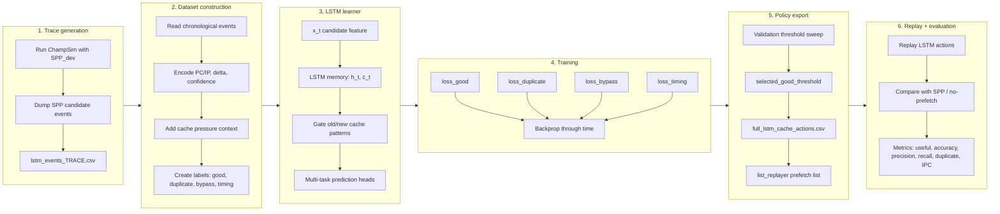

# LSTM Cache-Action Predictor Pipeline Story

This note explains the current LSTM-based cache-action learning flow as a story. It is meant to be easier to read than the main README and to match the diagrams used when explaining the project.

## 0. One-sentence summary

```text
SPP proposes candidate prefetches; the LSTM reads each candidate plus cache context over time and learns whether to keep, suppress, bypass, or deprioritize that candidate.
```

This is **not** direct next-address prediction as the final story. The useful framing is:

```text
SPP = candidate generator + feature/context provider + supervision source
LSTM = sequential cache-action learner / candidate utility selector
Replay = system-level validation in ChampSim
```

## 1. End-to-end project flow



## 2. What one row means

Each row in `lstm_events_TRACE.csv` represents one SPP-related candidate event. It is not just an address. It includes the current demand context, the candidate prefetch address, and outcome labels.



The replay-critical field is `replay_access_idx`, not `event_id`. The prefetch list must use:

```text
replay_access_idx 0xprefetch_byte_addr
```

This matters because `list_replayer` advances an internal counter only on L2 demand accesses, and it parses the second column as hexadecimal.

## 3. Model architecture

At every time step `t`, the model reads one SPP candidate event.



## 4. What the LSTM gates mean for cache behavior



In cache terms, the LSTM is learning phase-sensitive behavior:

```text
same PC + same delta may be useful in one phase but harmful in another phase
cache pressure changes the value of issuing a candidate
recent duplicate/useful history changes whether a new candidate should be trusted
```

## 5. Training and export



## 6. Runtime decision logic



Current implementation is replay-based, not yet an online hardware deployment. That means the IPC result validates the learned policy, but it does not include online neural inference latency.

## 7. Baseline SPP vs LSTM-gated SPP



Important distinction:

```text
Offline candidate-selection accuracy:
  LSTM can be much better than raw SPP candidate emission.

True ChampSim prefetch accuracy and IPC:
  SPP is still stronger on 602.gcc_s-734B.
```

## 8. Current 602.gcc_s-734B checkpoint

Warmup / simulation:

```text
25M warmup / 25M simulation
```

Fixed replay requirements:

```text
Use replay_access_idx, not event_id/cycle.
Write prefetch addresses as hex, not decimal.
Use L2 list_replayer binary.
```

Observed fixed replay results:

| Method | IPC | Speedup vs no-prefetch | L2 useful | L2 useless | Interpretation |
|---|---:|---:|---:|---:|---|
| no-prefetch | 0.5427 | 1.0000x | N/A | N/A | baseline |
| SPP baseline | 1.4440 | 2.6608x | 140,717 | 652 | strongest current baseline |
| LSTM fixed replay th0.20 | 0.7175 | 1.3221x | 64,473 | 48,530 | best observed LSTM result so far |
| LSTM fixed replay th0.25 | 0.7172 | 1.3215x | 64,420 | 48,533 | essentially tied with th0.20 |
| LSTM fixed replay th0.35 | 0.6371 | 1.1739x | 16,348 | 70,171 | lower recall / less effective |
| LSTM fixed replay th0.40 | 0.5521 | 1.0173x | 3,933 | 4,142 | too conservative |

Current conclusion:

```text
The fixed LSTM replay is valid and positive: it improves gcc IPC by about 32% over no-prefetch.
However, SPP still wins in both IPC and true ChampSim prefetch accuracy.
```

## 9. Final overview



## 10. What to say in a meeting

A concise version:

```text
I used SPP as a candidate generator and trained a stateful LSTM to learn which SPP candidates are useful, duplicate, bypass-worthy, or timing-sensitive. The key bug was in replay alignment: the model output originally used event_id/cycle and decimal addresses, but ChampSim list_replayer needs L2 demand-access indices and hexadecimal byte addresses. After fixing that, the LSTM replay became valid: on gcc, it improves IPC from 0.5427 to 0.7175, about 1.32x over no-prefetch. SPP is still much stronger at 1.444 IPC, so the current result is not beating SPP yet, but it proves the learned action policy can produce useful prefetches and real IPC gain once replay is correct.
```
