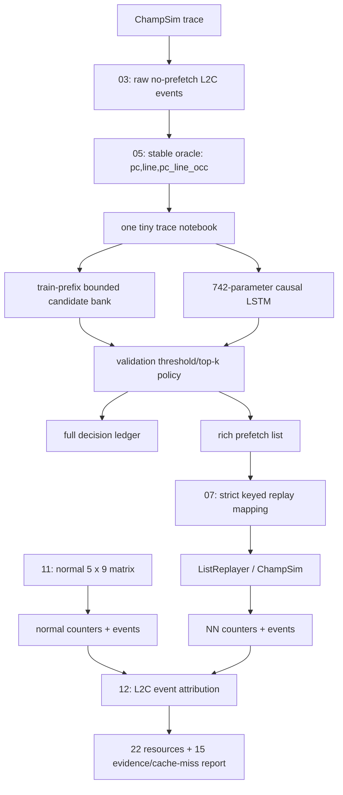
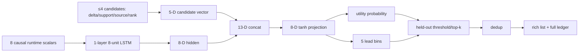
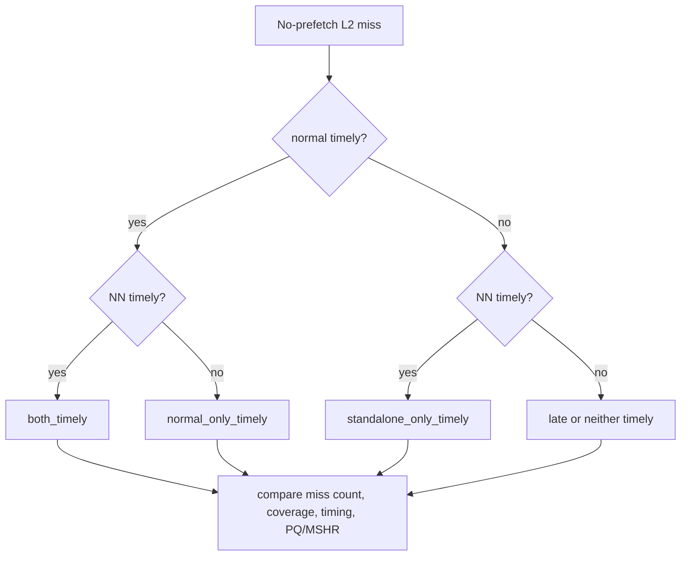

# 07/05 Tiny Trace-Specialized LSTM: Design, Replay, and Evidence Protocol

## What this experiment is—and is not

The v4.0 design used roughly 4.15M trainable parameters. The new shared implementation, `formal_NN_training/LSTM/tiny_trace_prefetcher.py`, is a **742-trainable-parameter** causal LSTM; it asserts that count at runtime. The five notebooks specialize only the bounded candidate representation and held-out policy, not the NN size.

This is a hardware-feasibility experiment. It does **not** claim a result before ChampSim keyed replay. Training precision is a candidate-level proxy; replay plus event attribution decides IPC, L2 misses, timeliness, and pressure.

## Frozen v4.0 reference

| trace | v4.0 best normal | normal IPC | v4.0 winner IPC | winner − normal | v4.0 winner L2 misses | new objective |
|---|---|---:|---:|---:|---:|---|
| 602.gcc_s-734B | sandbox | 0.43628 | 0.42918 | -0.00710 | 16,247 | reproduce / close gap |
| 605.mcf_s-994B | AMPM (tied IPC with SPP) | 0.18874 | 0.19185 | +0.00311 | 646,341 | exceed |
| 619.lbm_s-4268B | sms | 0.38105 | 0.37252 | -0.00853 | 59,436 | reproduce / close gap |
| 620.omnetpp_s-874B | sms | 0.24695 | 0.24227 | -0.00468 | 268,782 | reproduce / close gap |
| 623.xalancbmk_s-700B | spp | 0.35391 | 0.37863 | +0.02472 | 62,512 | exceed |

The design follows the required conditional goal: for 602/619/620, normal is strong and the NN must first reproduce it; for 605/623, normal is weak or near-neutral and the NN is expected to exceed it.

A critical v4.0 lesson is that **precision is not coverage**. On 602, the v4 NN winner had very high selected accuracy yet more L2 demand misses than Sandbox. A model can accurately prefetch a narrow subset and still lose IPC or miss coverage.

## End-to-end flow



The replay key is `pc,line,pc_line_occ`. Script 07 verifies direct rich-list indices against the corresponding oracle PC and line.

## Neural architecture

| component | shape | parameters |
|---|---:|---:|
| causal LSTM | 8 input, 8 hidden, 1 layer | 576 |
| candidate projection | 13 → 8 | 112 |
| utility head | 8 → 1 | 9 |
| lead head | 8 → 5 | 45 |
| **total** |  | **742** |

At each L2 demand the LSTM consumes eight causal scalar features: stable PC hash, current and previous line delta, page offset, PC reuse gap, cycle gap, past 128-event miss density, and optional static dependency support. The bank emits at most four candidates, each described by delta, train-prefix support, source ID, rank, and validity. The 8-D hidden state plus 5-D candidate vector form the 13-D projection input. Outputs are utility and lead-bin probabilities `{4,8,16,32,64}`.



Training uses a chronological 80/20 split, train-prefix-only dynamic candidate tables, weighted BCE utility loss plus five-class lead loss, 1024-event truncated BPTT, and validation-only policy calibration. Normal-prefetcher outputs are never training labels, NN inputs, or runtime features. The output is offline keyed replay, not in-simulator PyTorch inference.

## Per-trace policy

| trace | normal reference / target | sources (max 4 candidates) | lead window | export dedup |
|---|---|---|---:|---:|
| 602 | Sandbox / reproduce | assoc×2, pc_delta×1, global×1 | 4–64 | 256 |
| 605 | AMPM/SPP / exceed | dependency×2, pc_delta×1, global×1 | 4–128 | 256 |
| 619 | SMS / reproduce | pc_delta×2, pc_prev_delta×1, global×1 | 8–128 | 0 |
| 620 | SMS / reproduce | region_pair×2, predecessor×1, global×1 | 4–128 | 256 |
| 623 | SPP / exceed | context3×2, phase_offset×1, global×1 | 4–64 | 256 |

The 605 sidecars are mandatory:

```text
formal_NN_training/data/upload/v3_9_dependency_profiles/
  605.mcf_s-994B.v3_9_dependency_profile.csv.gz
  605.mcf_s-994B.v3_9_dependency_edge_vocab.csv.gz
```

They are static raw-training-prefix data; they do not create a future raw-trace/oracle event join.

## Input preflight

```bash
cd ~/cache
git pull --ff-only

python3 - <<'PY'
from pathlib import Path
traces = ['602.gcc_s-734B','605.mcf_s-994B','619.lbm_s-4268B','620.omnetpp_s-874B','623.xalancbmk_s-700B']
root = Path('formal_NN_training/results/standalone_nn_data/oracle')
required = [root / (t + suffix) for t in traces for suffix in ('.oracle.csv.gz','.oracle.csv.gz.meta.json')]
side = Path('formal_NN_training/data/upload/v3_9_dependency_profiles')
required += [side/'605.mcf_s-994B.v3_9_dependency_profile.csv.gz', side/'605.mcf_s-994B.v3_9_dependency_edge_vocab.csv.gz']
missing = [str(p) for p in required if not p.is_file() or p.stat().st_size == 0]
if missing:
    raise SystemExit('MISSING:\n' + '\n'.join(missing))
print('PASS: five oracles and the 605 sidecars are present.')
PY
```

The pasted filesystem layout already lists all five raw-oracle datasets and the 605 sidecars. The notebooks need no raw `.xz` input; replay does.

### Rebuild only when the input is missing or intentionally refreshed

```bash
cd ~/cache
TRACES='602.gcc_s-734B 605.mcf_s-994B 619.lbm_s-4268B 620.omnetpp_s-874B 623.xalancbmk_s-700B'
TRACES="$TRACES" WARMUP=25000000 SIM=25000000 MAX_JOBS=2 \
  bash formal_NN_training/scripts/03_collect_no_pref_demand_events.sh

for trace in $TRACES; do
  python3 formal_NN_training/scripts/05_build_standalone_oracle_dataset.py \
    --events "formal_NN_training/results/standalone_nn_data/demand_events/events/$trace.no_pref.events.csv.gz" \
    --trace "$trace" \
    --out "formal_NN_training/results/standalone_nn_data/oracle/$trace.oracle.csv.gz"
done
```

## Full normal-prefetcher matrix

Run all 45 normal cases with event logs; counter-only mode cannot support miss-overlap analysis.

```bash
cd ~/cache
RUN_TAG='normal_matrix_20260705'
OUT="$PWD/formal_NN_training/results/prefetch_experiments/$RUN_TAG"
OUT_ROOT="$OUT" RUN_TAG="$RUN_TAG" \
TRACES='602.gcc_s-734B 605.mcf_s-994B 619.lbm_s-4268B 620.omnetpp_s-874B 623.xalancbmk_s-700B' \
NORMAL_PREFETCHERS='no_pref stride streamer ampm spp ipcp sms sandbox power7' \
MODE=normal COLLECT_EVENT_LOGS=1 BUILD=1 WARMUP=25000000 SIM=25000000 MAX_JOBS=2 FORCE=0 \
bash formal_NN_training/scripts/11_run_prefetch_event_attribution.sh
```

`$OUT/normal/summary.csv` records IPC, L2 misses/rate, request/drop/issue/fill/useful/useless/late counts, duplicate proxy, selected accuracy, coverage, and timeliness.

## Colab notebooks and export

Run these independently:

```text
formal_NN_training/LSTM/notebooks/07_05_tiny_lstm_602_gcc.ipynb
formal_NN_training/LSTM/notebooks/07_05_tiny_lstm_605_mcf.ipynb
formal_NN_training/LSTM/notebooks/07_05_tiny_lstm_619_lbm.ipynb
formal_NN_training/LSTM/notebooks/07_05_tiny_lstm_620_omnetpp.ipynb
formal_NN_training/LSTM/notebooks/07_05_tiny_lstm_623_xalancbmk.ipynb
```

Each archive preserves its repo-relative artifact path. Unzip all archives from the repository root, then combine the plans:

```bash
cd ~/cache
ART="$PWD/formal_NN_training/artifacts/tiny_trace_lstm_07_05"
PLAN="$ART/replay_plan.csv"
{
  echo 'tag,trace,source_rel,candidate_role,model_family,recipe,policy_tag,artifact_tag,provisional_primary,goal'
  find "$ART" -mindepth 3 -name replay_plan.csv -type f -print0 | sort -z |
  while IFS= read -r -d '' plan; do tail -n +2 "$plan"; done
} > "$PLAN"
column -s, -t < "$PLAN"
```

## Full replay and evidence run

```bash
cd ~/cache
PLAN="$PWD/formal_NN_training/artifacts/tiny_trace_lstm_07_05/replay_plan.csv"
RUN_TAG='tiny_trace_lstm_20260705_full'
OUT="$PWD/formal_NN_training/results/prefetch_experiments/$RUN_TAG"

OUT_ROOT="$OUT" RUN_TAG="$RUN_TAG" REPLAY_PLAN="$PLAN" PLAN_ROOT="$PWD" \
TRACES='602.gcc_s-734B 605.mcf_s-994B 619.lbm_s-4268B 620.omnetpp_s-874B 623.xalancbmk_s-700B' \
NORMAL_PREFETCHERS='no_pref stride streamer ampm spp ipcp sms sandbox power7' \
MODE=both COLLECT_EVENT_LOGS=1 BUILD=1 WARMUP=25000000 SIM=25000000 MAX_JOBS=2 FORCE=0 \
bash formal_NN_training/scripts/11_run_prefetch_event_attribution.sh

python3 formal_NN_training/scripts/09_parse_standalone_lstm_replay.py \
  --event-root "$OUT" --baseline-summary "$OUT/normal/summary.csv" \
  --replay-plan "$PLAN" --plan-root "$PWD" \
  --out "$OUT/lstm/summary.csv" --winner-out "$OUT/lstm/winners.csv"

TRACES='602.gcc_s-734B 605.mcf_s-994B 619.lbm_s-4268B 620.omnetpp_s-874B 623.xalancbmk_s-700B'
PFS='no_pref stride streamer ampm spp ipcp sms sandbox power7'
python3 formal_NN_training/scripts/12_analyze_prefetch_event_attribution.py \
  --event-root "$OUT" --oracle-dir formal_NN_training/results/standalone_nn_data/oracle \
  --out-dir "$OUT/analysis" --traces "$TRACES" --normal-prefetchers "$PFS" \
  --replay-plan "$PLAN" --plan-root "$PWD" --write-event-rows
python3 formal_NN_training/scripts/22_resource_summary.py \
  --event-root "$OUT" --out "$OUT/analysis/resource_summary.csv"
```

Create profiles and merge the report:

```bash
PROFILE_DIR="$OUT/trace_profiles"; mkdir -p "$PROFILE_DIR"
for trace in $TRACES; do
  python3 formal_NN_training/scripts/10_profile_champsim_trace.py \
    --trace "traces/$trace.champsimtrace.xz" --out-dir "$PROFILE_DIR"
done
python3 formal_NN_training/scripts/15_summarize_prefetch_evidence.py \
  --trace-profile-dir "$PROFILE_DIR" --baseline-summary "$OUT/normal/summary.csv" \
  --attribution-dir "$OUT/analysis" --replay-summary "tiny=$OUT/lstm/summary.csv" \
  --out-dir "$OUT/evidence" --traces "$TRACES"
```

Read `normal/summary.csv`, `lstm/summary.csv`, `analysis/run_unique_event_outcomes.csv`, `analysis/normal_vs_standalone_target_attribution.csv`, `analysis/resource_summary.csv`, `evidence/cache_miss_comparison.csv`, and `evidence/trace_prefetch_evidence_report.md` in that order.

## Why high precision can still produce different miss counts

`selected_accuracy = useful / issued` does not show whether normal and NN cover the same no-prefetch miss population. Both can be high precision but differ through coverage, lead/timeliness, cache residency, top-k or dedup rejection, PQ/MSHR pressure, duplicates, and target overlap.



For `normal_only_timely`, the full decision ledger distinguishes: candidate absent from the bank; below threshold; rank/top-k rejection; dedup suppression; and selected-but-late/not-timely. A missing selected rich-list row alone is **not** proof of candidate-bank absence.

## Script audit

Keep the general pipeline: `01`, `02`, `03`, `05`, `06`, `07`, `08`, `09`, `10`, `11`, `12`, `15`, and `22`. Script 09 now supports the event-root layout written by script 11, and script 15 writes `cache_miss_comparison.csv`.

Keep but label as specialized controls: `13`/capacity `14` are frozen-list capacity sensitivity only; `14_build_base_candidate_table.py` is base-aware research only; `16`/`17` produce 605 dependency sidecars; `19`/`20` are oracle ceilings; and `21` expects a specific v4 aggregate-ledger schema.

`25_build_v4_1_notebook.py` is retired because its required extension payload is absent. The five explicit 07/05 notebooks supersede it.

## Cleanup discipline

Do not delete all `.txt` files: `RUN_INFO.txt` and `*.build_info.txt` are provenance. Historical `prefetch_list_*.txt`, `replay_log_hits.txt`, and `status_before.txt` are not current raw-oracle inputs, but inspect/archive them before removal:

```bash
cd ~/cache
find formal_NN_training -type f \
  \( -name 'prefetch_list_*.txt' -o -name 'replay_log_hits.txt' -o -name 'status_before.txt' \) \
  -printf '%p\t%k KiB\n' | sort
```

A valid result records the trace/window/binary, 742 parameter count, candidate policy, replay transport status, IPC, L2 misses, accuracy, event coverage/timeliness, and resource pressure. A notebook validation value or a small network alone is not a prefetch result.
