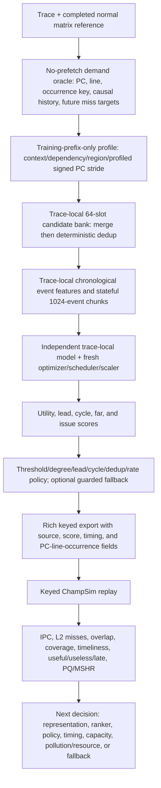
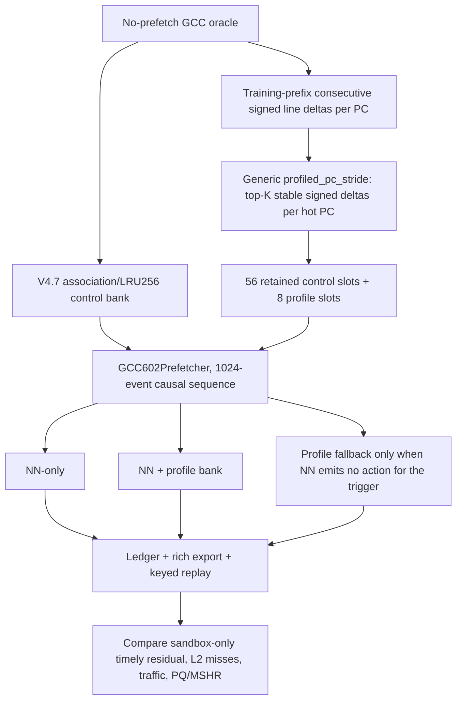
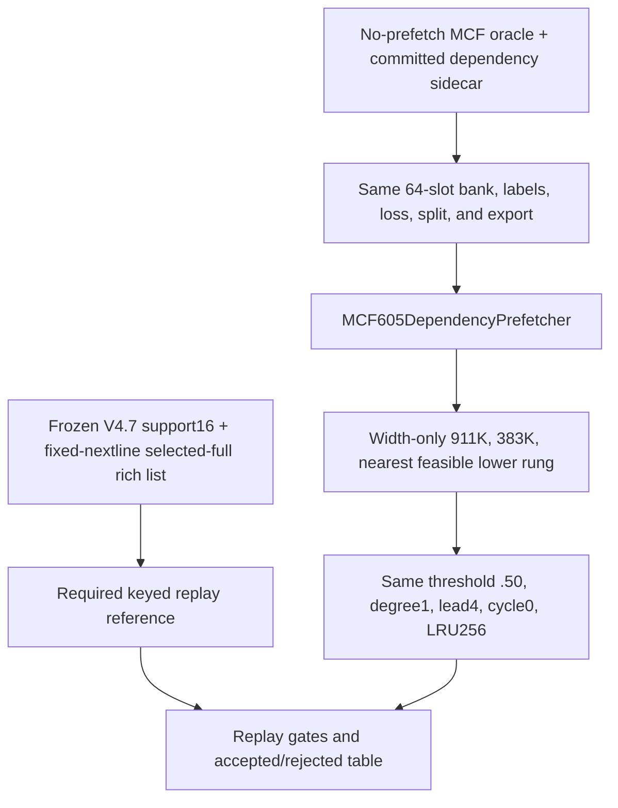
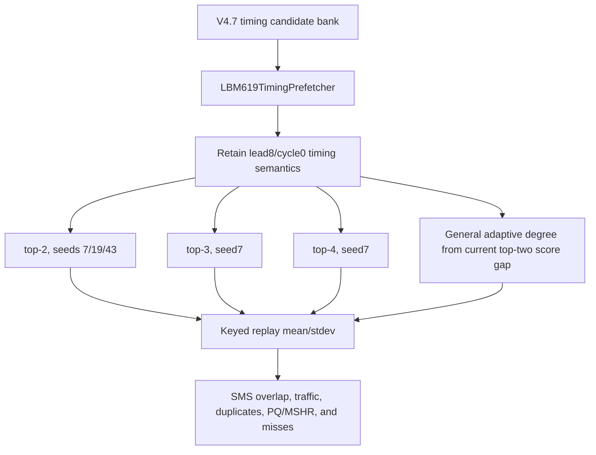
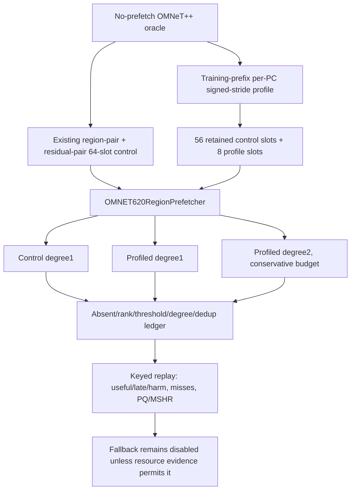
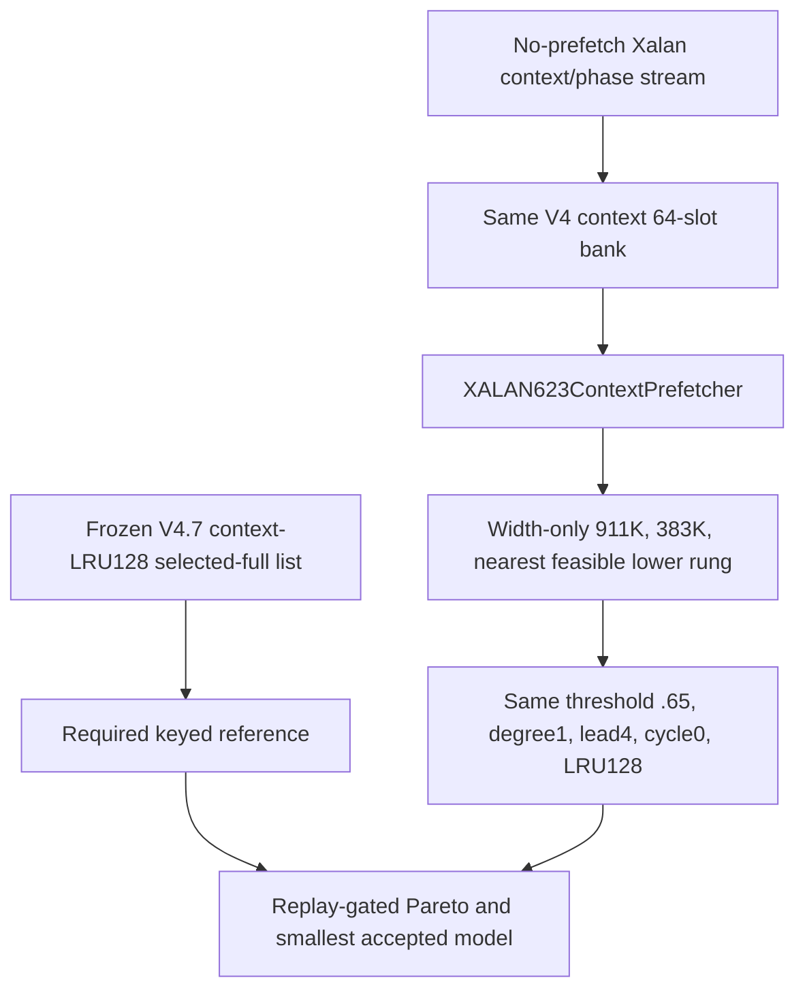

# V4.8: Independent Trace-Local Neural Prefetcher Study

**Status: implementation and replay protocol, not a performance claim.** A V4.8 NN is not called better than a normal prefetcher until its own exported PC-line-occurrence list completes valid keyed ChampSim replay and is compared with the completed fixed normal matrix.

## Method: what, why, how, measurement, next decision

V4.8 is one Colab notebook for organization, **not one shared model**. It implements five isolated pipelines:

| Trace | Independent class | Frozen V4.7 full reference | Best fixed normal | First V4.8 question |
|---|---|---:|---:|---|
| `602.gcc_s-734B` | `GCC602Prefetcher` | 0.42916 IPC | sandbox, 0.43628 | Are dynamic-next-line residual targets absent from the bank, and can a generic PC-stride profile close the gap without resource harm? |
| `605.mcf_s-994B` | `MCF605DependencyPrefetcher` | 0.19146 IPC | AMPM, 0.18874 | With the route frozen, what is the smallest replay-acceptable capacity? |
| `619.lbm_s-4268B` | `LBM619TimingPrefetcher` | 0.36984 IPC | SMS, 0.38105 | Does degree rather than representation prevent conversion of timely targets into IPC? |
| `620.omnetpp_s-874B` | `OMNET620RegionPrefetcher` | 0.24295 IPC | SMS, 0.24695 | Are critical targets absent from the region/residual bank before model size is changed? |
| `623.xalancbmk_s-700B` | `XALAN623ContextPrefetcher` | 0.37872 IPC | SPP, 0.35391 | With the route frozen, what is the smallest replay-acceptable capacity? |

V4.8 separates three questions that must not be conflated:

1. **Candidate representation / reachability:** is the useful future line in the fixed 64-slot bank?
2. **Ranking and policy:** if it is reachable, is it ranked, selected, issued early enough, and not suppressed by threshold, degree, dedup, or rate control?
3. **Capacity:** only after the route, features, labels, bank, loss, policy, and export semantics are frozen, how small can the NN become?

Offline loss and selected accuracy are diagnostic. IPC, L2 misses, event-level timeliness, issue traffic, useful/useless/late behavior, acceptance/rejection/duplicate behavior, PQ, and MSHR behavior are keyed-replay measurements.



## Isolation and one-A100 scheduling

Each trace independently owns its model class and weights, optimizer, cosine scheduler, AMP scaler, causal split, feature normalization, candidate bank/profile, labels, recurrent state, policy sweep, ledger, checkpoint, export, metadata, replay-plan rows, and artifact subtree. No trace shares weights, optimizer state, candidate data, state, export, or artifact path.

`V48_EXECUTION_MODE=sequential` is the default: finish one complete trace-local job, release CUDA memory, then run the next. `worker_shard` is controlled parallelism across separate Colab sessions only; workers own non-overlapping traces and write to separate roots:

```text
formal_NN_training/artifacts/v4_8/runs/<RUN_ID>/worker_XX_of_YY/
```

## Model, parameter, and storage accounting

Every trace instantiates the same V4.7-compatible **family**, but not the same object or weights:

```text
causal hashed event features + continuous features
  -> event embeddings + continuous projection
  -> two-layer chronological LSTM
  -> LayerNorm + context MLP
candidate delta/source/page-delta/offset embeddings
  -> candidate projection
[event context, candidate, elementwise product]
  -> rank MLP
  -> utility, lead-bin, cycle-bin, far, issue heads
```

The five independently instantiated classes are `GCC602Prefetcher`, `MCF605DependencyPrefetcher`, `LBM619TimingPrefetcher`, `OMNET620RegionPrefetcher`, and `XALAN623ContextPrefetcher`.

Parameter counts are always computed after instantiation:

```python
trainable_params = sum(p.numel() for p in model.parameters() if p.requires_grad)
```

The common post-dependency feature schema has nine continuous inputs. The selected-full configuration therefore reproduces the V4.7 compatible 4,147,959 trainable-parameter count. The compression rungs retain the same architecture family and only alter width-like dimensions:

| Rung | Event embedding | Candidate embedding | Continuous projection | Hidden state | Layers |
|---|---:|---:|---:|---:|---:|
| `selected_full` | 40 | 40 | 24 | 160 | 2 |
| `about_911k` | 10 | 10 | 8 | 40 | 2 |
| `about_383k` | 4 | 4 | 4 | 20 | 2 |
| `nearest_100k` | 1 | 1 | 1 | 4 | 2 |

The code records the actual count for every rung; it never relabels a rung as 100K if its measured count is different. Each job separately reports trainable parameters, FP32 parameter bytes, layer dimensions, state/embedding dimensions, bank slots, candidate-source/profile/table bytes, checkpoint bytes, export rows/bytes, and online dedup/fallback storage. Rich replay lists are experiment artifacts, **not** claimed hardware tables.

## Shared data, labels, and training protocol

The NN training source is the no-prefetch oracle. Normal-prefetcher outputs are comparison evidence only and never create NN labels. The split is chronological; candidate profiles fit only the usable training prefix, with the maximum horizon excluded at the boundary. Sequence order is demand-event order and chunks have length 1024.

Event features include current/previous PC, page, line, PC-page, PC-previous-PC, delta history, page offset, delta/sign/magnitude, operation/register metadata, dependency context where available, reuse/cycle-gap buckets, and continuous causal features. Candidate labels match future no-prefetch demand-miss targets across lead bins. The fixed multi-head loss remains focal utility BCE + lead CE + cycle CE + far BCE + issue BCE + pairwise ranking loss. Every job uses a fresh AdamW optimizer, cosine scheduler, AMP scaler, gradient clipping, chronological validation, and early stopping.

## Per-trace route flowcharts

### 602.gcc_s-734B: dynamic next-line residual coverage



`profiled_pc_stride` is causal and general: it learns from the training prefix only; supports positive, negative, and non-power-of-two line deltas; and contains no hardcoded trace ID, PC, address, or delta. Fallback emits one profile-derived line only for an uncovered trigger and uses the same dedup discipline.

### 605.mcf_s-994B: frozen route, Stage-B capacity



The notebook fails if the exact frozen selected-full list is absent. It does not silently retrain or redesign the reference.

### 619.lbm_s-4268B: degree bottleneck and variance



The adaptive rule uses current score gap only; it has no PC/address allowlist.

### 620.omnetpp_s-874B: candidate-bank blind spots



The default leaves fallback off; `V48_ENABLE_620_FALLBACK=1` is explicit.

### 623.xalancbmk_s-700B: frozen route, Stage-B capacity



## Route and size methodology

| Trace | First comparison | Size reduction rule |
|---|---|---|
| 602 | NN-only, profile bank, profile fallback, high-confidence NN + fallback | Run only after replay selects one route through `V48_SELECTED_FOR_SIZE_JSON` |
| 605 | Frozen V4.7 route | selected-full reference plus three width-only rungs |
| 619 | top-2/top-3/top-4/adaptive degree plus seed variance | Run only after replay chooses degree route |
| 620 | control degree1, profile degree1, profile degree2, optional resource-gated fallback | Run only after replay chooses route |
| 623 | Frozen V4.7 route | selected-full reference plus three width-only rungs |

A fair route comparison holds split, oracle, labels, bank rule except the explicitly tested profile extension, export format, replay method, and window fixed. A capacity comparison holds everything except neural width-related dimensions fixed.

## Diagnostics and Stage-B gates

For every route/architecture/seed/size the notebook exports: trainable and non-neural storage; candidate recall before policy; correct-target rank recall at top-1/top-2/top-4; selected accuracy; coverage; timeliness; issue rate; candidate-absent, rank-low, threshold, top-k/degree, dedup/rate, and selected counts; and a full decision ledger. Keyed replay adds IPC, all-normal IPC deltas, L2 loads/misses, useful/useless/late, issued/dropped/accepted/rejected/duplicate behavior, resource p95, and export rows/bytes.

For 605 and 623, a smaller rung is accepted only if valid keyed replay passes every comparison against the frozen selected-full reference:

| Gate | Requirement |
|---|---:|
| IPC | at least 99.5% |
| selected accuracy | at least 95% |
| event coverage | at least 95% |
| event timeliness | at least 95% |
| issue rate | at most 110% |
| PQ p95 and MSHR p95 | at most 110% each |
| rejected and duplicate fraction | increase at most 5 percentage points each |

`23_analyze_v4_8_replay.py` records every exact failed predicate. Missing required replay/resource evidence is a rejection, not an automatic pass.

## Why high normal and NN accuracy do not imply the same cache misses

Accuracy summarizes selected predictions under one definition. Cache misses are per-demand outcomes in a constrained hierarchy. Two accurate predictors can still differ because they issue the same line at different lead times; one line is evicted before use; one occupies queue/MSHR capacity and delays a different action; their timely target sets overlap only partially; their candidate-bank reach differs; or the same target has different cache residency because of competing traffic and pollution.

The existing event-attribution path therefore produces `both_timely`, `normal_only_timely`, `standalone_only_timely`, `both_late`, and `neither_timely` categories, normal-only reasons, event rows, L2 miss deltas, and PQ/MSHR summaries. A missing selected-export address is not proof of candidate absence; the full V4.8 ledger distinguishes absent candidates from rank/policy rejection.

## Outputs and server replay

The run root contains one artifact subtree and one replay plan per trace, one combined plan, architecture/route/size tables, `v4_8_all_job_metadata.csv`, Stage-B criteria, `v4_8_manifest.json`, and `server/v4_8_combined_replay.sh`.

The generated server driver reuses completed normal event logs and calls only general standard-library pipeline scripts:

```text
11 MODE=lstm -> 09 replay summary -> 12 event attribution -> 22 resource summary
-> 15 evidence/cache-miss comparison -> 23 V4.8 replay-gated analysis
```

```bash
cd ~/cache
git pull --ff-only origin main
RUN_ID=v4_8_independent_seed7
RUN_DIR="$PWD/formal_NN_training/artifacts/v4_8/runs/$RUN_ID/worker_00_of_01"
python3 -m py_compile formal_NN_training/scripts/23_analyze_v4_8_replay.py
bash -n "$RUN_DIR/server/v4_8_combined_replay.sh"
NORMAL_SUMMARY="$PWD/formal_NN_training/results/prefetcher_baselines/summary.csv" \
NORMAL_EVENT_ROOT="$PWD/formal_NN_training/results/prefetch_experiments/v4_7_all_candidates_replay_evidence_20260706" \
MAX_JOBS=1 nohup bash "$RUN_DIR/server/v4_8_combined_replay.sh" "$PWD" "$RUN_DIR" \
  > "$PWD/nohup_v4_8_${RUN_ID}_replay.log" 2>&1 &
echo $! > "$PWD/nohup_v4_8_${RUN_ID}_replay.pid"
tail -f "$PWD/nohup_v4_8_${RUN_ID}_replay.log"
```

## History, limitations, and claim boundary

V4.8 retains V3.3 context/bank diagnostics, V3.6/V3.7 trace-local fixed-budget framing, V3.8 AMP discipline, V3.9 keyed replay discipline, V4.0 lead-aware timing, and V4.7 residual bottleneck evidence. It rejects V4.1 tiny-model comparisons as pure capacity evidence because they changed bank/policy as well as width.

Static parsing, safe-width instantiation, synthetic forward checks, and shell syntax checks do not prove real A100 training or a 25M/25M ChampSim replay. Offline NN parameters are not total deployable storage. Event overlap establishes measured associations, not a complete causal microarchitectural proof. Any apparent offline improvement remains `pending_keyed_replay` until transport, miss, timing, and resource evidence pass.
