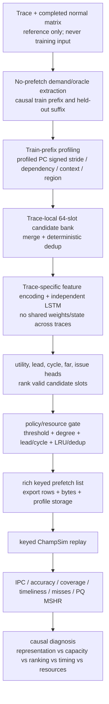
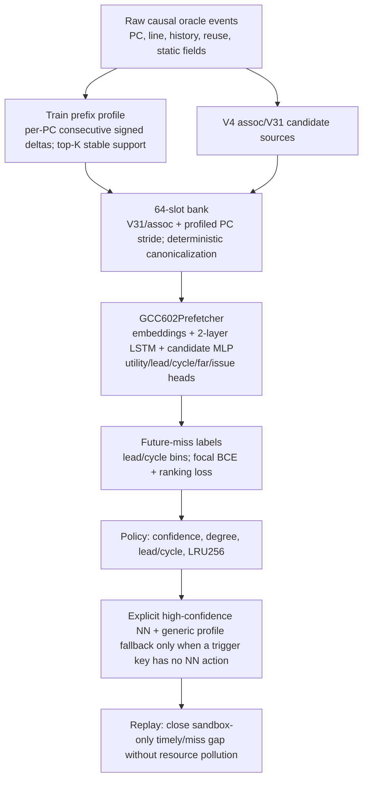
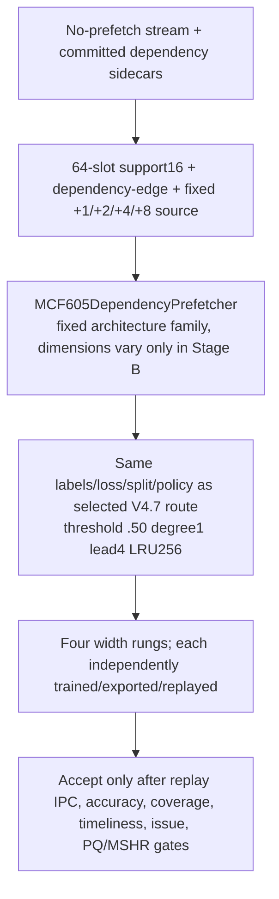
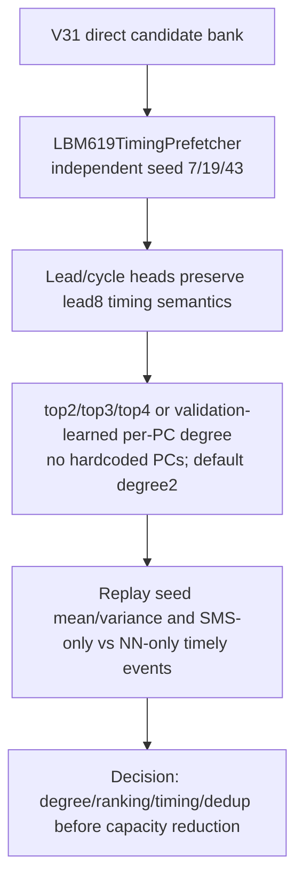
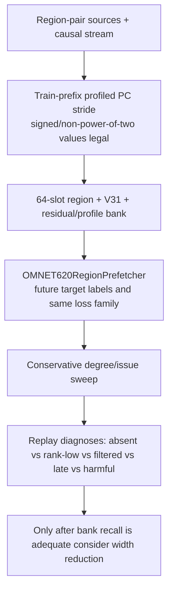
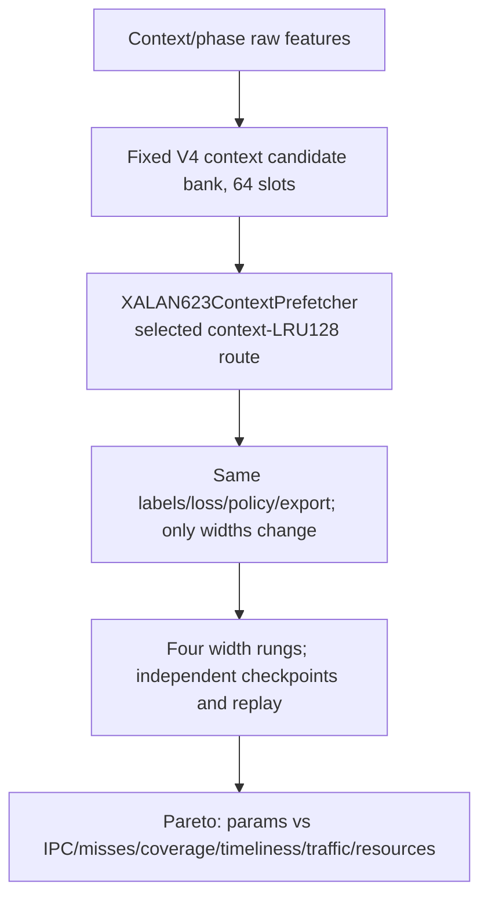

# V4.8 Independent Trace-Prefetcher Design

## Methodological principle

V4.8 applies the lecture’s distinction between **representation**, **capacity**, and **system objective**. A candidate bank determines what target actions are representable; the trace-local neural ranker decides how to score/rank those represented candidates; the final decision is based on keyed ChampSim replay IPC, misses, coverage, timeliness, and resource behavior rather than empirical loss alone. Validation is used for causal diagnostics and policy calibration, while held-out replay is the system-level acceptance test.

## Global flow



## Trace rationale and flowcharts

| Trace | Starting verified mechanism | V4.8 bottleneck tested | Immediate action |
|---|---|---|---|
| 602.gcc | V4 assoc-LRU control: accurate/timely but below sandbox | normal-only timely residual / candidate absence | general train-prefix `profiled_pc_stride`, hybrid only on uncovered trigger keys |
| 605.mcf | V4.7 support16+fixed-nextline exceeded AMPM | preserve winning route; capacity only | Stage-B widths full → ~911K → ~383K → nearest feasible ~100K |
| 619.lbm | timing route below SMS, duplicate traffic | degree/rank/timing and seed variance | 3 seeds; top2/top3/top4/adaptive per-PC degree |
| 620.omnetpp | residual pair increased coverage but below SMS | candidate-bank blind spots with resource headroom | general signed profile stride + conservative degree sweep |
| 623.xalancbmk | context LSTM strongly exceeds SPP | preserve winning route; capacity only | Stage-B widths full → ~911K → ~383K → nearest feasible ~100K |

### 602.gcc


### 605.mcf


### 619.lbm


### 620.omnetpp


### 623.xalancbmk


## Architecture, labels, training, and storage

Each trace owns a separate model class, optimizer, scheduler, normalization, train/validation split, candidate bank, state, checkpoint, ledger, list, and result directory. The default split is causal: the initial training prefix ends before the future-label horizon; the held-out suffix is validation. Sequences are chronological chunks of the trace-local configured length (1024 for V4.8 immediate Stage-B compatibility). Candidate labels are earliest future target lead-bin matches for the fixed 64 candidate slots; output heads are utility, lead, cycle, far, and issue; training uses the inherited V4 focal-BCE/ranking multihead loss with AdamW, cosine schedule, gradient clipping, validation every two epochs, and early stopping on finite validation loss.

The notebook writes programmatic parameter counts for every instantiated trace/size pair. It reports separately: neural parameters, layer/embedding/hidden dimensions, candidate-bank slot count, candidate/profile table bytes, exported rich-list rows and bytes, and checkpoint bytes. Neural parameter count is not presented as total deployment storage.

## Diagnostics and acceptance

For every job, V4.8 records candidate recall before policy, correct-target rank recall at top1/top2/top4, selected accuracy, offline timing proxy, policy issue rate, lost-target reason categories, decision ledger, full replay data, cache misses, useful/useless/late/issued/dropped/accepted/rejected/duplicates, and PQ/MSHR statistics. Event attribution compares every replay candidate to every completed normal prefetcher: both timely, normal-only timely, NN-only timely, neither timely, miss deltas, and cache-residency/resource differences available in the existing parsers.

For the 605 and 623 Stage-B fixed architecture ladders, a smaller model is accepted only if keyed replay passes all gates relative to the selected full reference: IPC >=99.5%, selected accuracy >=95%, coverage >=95%, timeliness >=95%, issue rate <=110%, PQ/MSHR p95 <=110%, and rejection/duplicate deltas <=5 percentage points. Failure tables state the exact gate(s) that fail.

## v3.3–V4.8 lessons

| Version | Retained lesson | Rejected/replaced behavior |
|---|---|---|
| v3.3 | context candidate coverage is valuable, especially 623 | one shared generic route is insufficient |
| v3.4–v3.7 | adaptive/context banks, ledgers, budgets, trace routing | offline accuracy alone as final criterion |
| v3.9 | profile/dependency evidence can guide candidate sources | raw future information or normal outcomes as inputs |
| v4.0 | 64-slot banks, multihead LSTM, keyed replay, event attribution | assuming high selected precision implies IPC |
| v4.1 tiny | sub-1000 lower bound is informative only when route is fixed | changing bank/features/policy together with size |
| v4.7 | per-trace bottlenecks differ; 605/623 can start size sweep | shrinking traces whose full route is not yet competitive |
| V4.8 | separate representation/route selection from fixed-route width reduction | silent fallbacks and hidden non-neural storage claims |

## Reproducibility

Colab runs the notebook top-to-bottom. Artifacts are under `formal_NN_training/artifacts/v4_8/<RUN_ID>/`. Copy the complete artifact directory to Sacramento, then run the exact server commands emitted by the notebook. The server reuses the completed normal matrix and calls existing scripts `11`, `09`, `12`, `22`, and `15`; it does not rerun normal prefetchers.

## Limitations

A replay rich-list and train-prefix table are artifacts, not a hardware microarchitecture implementation. V4.8 reports their bytes separately from trainable neural parameters. A future deployability study must translate the selected candidate sources, table capacities, and state updates into bounded online hardware storage/latency.


## Exact Colab and server commands

**Colab controls:** set `V48_TRACES` to a comma-separated subset before B0 (for example `605.mcf_s-994B,623.xalancbmk_s-700B`). The default runs all five traces sequentially on one A100. For independent external worker sessions, set `V48_SCHEDULE_MODE=worker_shard`, `V48_WORKER_ID=0|1`, and `V48_NUM_WORKERS=2`; each worker writes only its own non-overlapping job directories. Do not enable same-process multi-GPU training in one notebook process.

After B10 downloads the zip, transfer the **entire extracted run directory** to Sacramento under `~/cache/formal_NN_training/artifacts/v4_8/`. From `~/cache`, launch:

```bash
nohup bash formal_NN_training/artifacts/v4_8/<RUN_ID>/server/v4_8_combined_replay.sh \
  "$HOME/cache/formal_NN_training/artifacts/v4_8/<RUN_ID>" \
  > "$HOME/cache/nohup_v4_8_<RUN_ID>_replay.log" 2>&1 &
```

The script reuses the completed normal matrix and writes: `lstm/summary.csv`, event attribution, resource summary, cache-miss evidence, `analysis/v4_8_all_candidate_replay_comparison.csv`, `analysis/v4_8_route_seed_variance.csv`, `analysis/v4_8_selected_full_route_by_seed_mean_ipc.csv`, `analysis/v4_8_stage_b_acceptance.csv`, `analysis/v4_8_smallest_accepted_model_by_trace.csv`, and `analysis/v4_8_nn_vs_every_normal_ipc.csv`.

## Required tables written by V4.8

The Colab artifact contains one trace-local artifact directory and replay plan per trace plus `v4_8_combined_replay_plan.csv`; `v4_8_architecture_parameter_inventory.csv`; `v4_8_job_matrix.csv`; one metadata, ledger, policy, rank-diagnostic, training-history, bank-storage, and rich-list output per route/seed/size; and the replay acceptance thresholds. The server post-analysis writes the final five-trace normal comparison and causal route/size decision tables.
