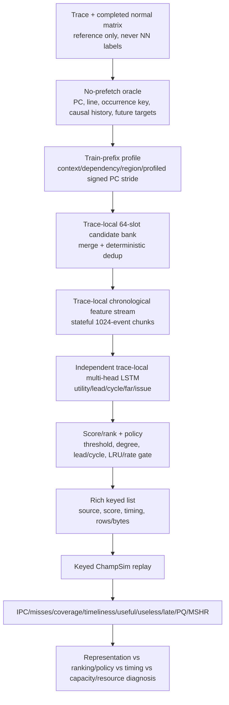

# V4.8 Independent Trace-Local Neural Prefetcher Study

**Status:** implementation and replay protocol. This README does not claim a V4.8 win before the generated keyed ChampSim replay completes and its transport, cache-miss, and resource checks pass.

## Methodological rule

V4.8 is one Colab notebook for operational convenience, not one universal NN. It runs five isolated pipelines: `602.gcc_s-734B`, `605.mcf_s-994B`, `619.lbm_s-4268B`, `620.omnetpp_s-874B`, and `623.xalancbmk_s-700B`.

The experiment separates three questions that must not be conflated:

1. **Candidate representation / reachability:** is a useful future line in the 64-slot candidate bank?
2. **Ranking and policy:** if reachable, is it scored and emitted under the threshold, degree, timing, and dedup rules?
3. **Capacity:** only after route, features, labels, candidate bank, and policy are frozen, what width is required?

Offline loss, selected precision, and rank recall are diagnostic signals. A claim against a normal prefetcher requires same-window PC-line-occurrence keyed ChampSim replay with IPC, L2-miss, timeliness, traffic, PQ, and MSHR evidence.

## Global flow



## Isolation and scheduler

Each trace owns a separate model class/object, optimizer, cosine scheduler, AMP scaler, recurrent state, causal train/validation split, candidate bank, labels, normalization statistics, checkpoint, decision ledger, policy table, rich list, replay-plan row, and artifact directory. No weights, optimizer state, candidate data, or artifacts are shared across traces.

`V48_EXECUTION_MODE=sequential` is the one-A100 default. It trains one complete job at a time and clears CUDA memory. Optional `worker_shard` partitions complete traces into non-overlapping `worker_XX_of_YY` roots for separately launched notebook sessions; it is not shared-state parallel training.

## Frozen V4.7 anchors

| Trace | Frozen/full route or current control | V4.7 IPC | Best normal | Best-normal IPC | V4.8 first action |
|---|---|---:|---|---:|---|
| 602 | association/LRU256 | 0.42916 | sandbox | 0.43628 | repair candidate coverage with general profile PC stride and controlled fallback |
| 605 | support16 + fixed-nextline | 0.19146 | AMPM | 0.18874 | fixed-route Stage-B size ladder |
| 619 | lead8/cycle0 top-2 | 0.36984 | SMS | 0.38105 | seed variance and top-2/top-3/top-4/adaptive degree |
| 620 | region-pair + residual-pair | 0.24295 | SMS | 0.24695 | repair candidate-bank blind spots before capacity |
| 623 | context-LRU128 | 0.37872 | SPP | 0.35391 | fixed-route Stage-B size ladder |

The Stage-B selected-full rows for 605 and 623 are exact frozen V4.7 rich-list references. The notebook fails if they are absent; it does not silently retrain or redesign a new reference.

## Common architecture and accounting

Every trace uses an independently instantiated V4.7-compatible multi-head LSTM family:

```text
hashed event features + continuous projection
  -> 2-layer chronological LSTM
  -> LayerNorm / context MLP
candidate delta/source/page-offset embeddings
  -> candidate projection
  -> [event, candidate, event*candidate] rank MLP
  -> utility(1), lead(L), cycle(C), far(1), issue(1) heads
```

The full rung has `emb_dim=40`, `candidate_emb_dim=40`, `cont_dim=24`, `hidden_dim=160`, and two layers. The fixed-route compression rungs are `width_025` (about 911K), `width_0125` (about 383K), and `nearest_100k` (about 156K; it is not falsely named 100K). The notebook programmatically counts trainable parameters after every model is instantiated and checks the compatible full model count is 4,147,959.

Every job reports separately:

- trainable NN parameters;
- layer/embedding/hidden dimensions;
- candidate-bank slot count;
- candidate source/profile/table bytes;
- checkpoint bytes;
- exported rows and bytes;
- policy/dedup/fallback and other non-neural storage fields.

Neural parameter count is never described as total deployable storage. Rich lists are replay artifacts, not claimed hardware tables.

## Per-trace flow

### 602.gcc_s-734B

```mermaid
flowchart TD
  A[No-prefetch GCC oracle] --> B[Train prefix: per hot PC consecutive signed delta counts]
  B --> C[General profiled_pc_stride\ntop-K stable + or - deltas]
  A --> D[V31/association sources]
  C --> E[64 slots: PC/global/fixed/association + 4 profiled slots]
  D --> E
  E --> F[GCC602Prefetcher]\n  F --> G[Four routes: NN-only; NN+profiled; uncovered-trigger fallback; high-confidence NN+fallback]
  G --> H[Replay: close sandbox-only timely/miss residual without traffic or queue harm]
```

`profiled_pc_stride` is causal and general: it learns only from the training prefix, permits negative and non-power-of-two line deltas, and has no hardcoded PC, address, or delta. Fallback emits one profile-derived line only when the NN emitted no action for that trigger, under the same LRU dedup state.

### 605.mcf_s-994B

```mermaid
flowchart TD
  A[Oracle + committed dependency sidecar] --> B[Fixed 64-slot support16 + fixed-nextline bank]
  B --> C[MCF605DependencyPrefetcher]\n  C --> D[Same V4.7 labels/loss/split/export and fixed .50/degree1/lead4/cycle0/LRU256 policy]
  D --> E[Exact V4.7 selected-full replay reference]
  D --> F[Width-only rungs]\n  E --> G[Replay gates]\n  F --> G
```

### 619.lbm_s-4268B

```mermaid
flowchart TD
  A[V31 timing bank] --> B[LBM619TimingPrefetcher, seeds 7/19/43]
  B --> C[lead8/cycle0 retained]\n  C --> D[top-2, top-3, top-4, or score-gap adaptive degree]
  D --> E[Replay against SMS; inspect timely overlap, duplicates, PQ/MSHR]
```

The adaptive rule uses only the current top-two score gap, never a PC/address allowlist.

### 620.omnetpp_s-874B

```mermaid
flowchart TD
  A[Oracle] --> B[region-pair + residual-pair control bank]
  A --> C[train-prefix profiled_pc_stride]
  B --> D[control route]\n  C --> E[profiled route: 32 static +16 region +8 residual +8 stride =64]
  D --> F[OMNET620RegionPrefetcher]\n  E --> F
  F --> G[conservative degree-1/degree-2 policy]\n  G --> H[ledger then keyed replay: absent/rank/threshold/dedup/late/harm]
```

### 623.xalancbmk_s-700B

```mermaid
flowchart TD
  A[Context/phase oracle features] --> B[Fixed V4 context 64-slot bank]
  B --> C[XALAN623ContextPrefetcher]\n  C --> D[Same V4.7 labels/loss/export and .65/degree1/lead4/cycle0/LRU128 policy]
  D --> E[Exact selected-full reference + width-only rungs]\n  E --> F[Replay-gated Pareto]
```

## Offline and replay diagnostics

For every job, V4.8 writes candidate recall before policy, top-1/top-2/top-4 target-rank recall, selected accuracy/timing proxy, issue rate, full compact decision ledger, and counts/percentages for absent candidates, rank/degree filtering, threshold filtering, dedup/rate limiting, other policy filtering, and selected targets. Replay then adds late, pollution/resource, useful/useless, accepted/rejected, duplicate, L2-miss, and IPC evidence.

The existing event-attribution scripts compare every normal prefetcher with each NN candidate: `both_timely`, `normal_only_timely`, `standalone_only_timely`, `both_late`, and `neither_timely`, plus L2-miss and queue counters. Therefore high normal and NN accuracy do not imply identical misses: the same line can be issued at different times, have different residency/eviction outcomes, or create different queue pressure.

## Stage-B acceptance

A smaller 605/623 model is accepted only after keyed replay passes every gate versus its frozen selected full reference:

| Gate | Requirement |
|---|---:|
| IPC | >= 99.5% |
| Selected accuracy | >= 95% |
| Coverage | >= 95% |
| Timeliness | >= 95% |
| Issue rate | <= 110% |
| PQ p95 / MSHR p95 | <= 110% each |
| Rejected/duplicate rate delta | <= +5 percentage points each |

`23_analyze_v4_8_replay.py` writes an accept/reject row for every rung with each exact failed predicate in `failure_reason`.

## Files and reproducibility

The Colab run root is:

```text
formal_NN_training/artifacts/v4_8/runs/<V48_RUN_ID>/worker_XX_of_YY/
```

It contains per-trace artifacts, separate trace tables, one plan per trace, the combined plan, `v4_8_all_job_metadata.csv`, architecture/route/size tables, acceptance criteria, and the generated `server/v4_8_combined_replay.sh`.

On Sacramento, use the generated driver after copying the complete run directory into the same repository-relative path. It calls `11` with `MODE=lstm`, then `09`, `12`, `22`, `15`, and `23`. It reuses completed normal event logs and does not rerun the normal matrix.

```bash
cd ~/cache
RUN_ID=v4_8_20260706_seed7
RUN_DIR="$PWD/formal_NN_training/artifacts/v4_8/runs/$RUN_ID/worker_00_of_01"
python3 -m py_compile formal_NN_training/scripts/23_analyze_v4_8_replay.py
bash -n "$RUN_DIR/server/v4_8_combined_replay.sh"
nohup env MAX_JOBS=1 \
  NORMAL_SUMMARY=formal_NN_training/results/prefetcher_baselines/summary.csv \
  NORMAL_EVENT_ROOT=formal_NN_training/results/prefetch_experiments/v4_7_all_candidates_replay_evidence_20260706 \
  bash "$RUN_DIR/server/v4_8_combined_replay.sh" "$PWD" "$RUN_DIR" \
  > "$HOME/cache/nohup_v4_8_${RUN_ID}_replay.log" 2>&1 &
```

## Limitations

A syntax/static or synthetic stride check cannot prove a full A100 run or ChampSim replay on real traces. No V4.8 candidate is called better than a normal prefetcher until valid keyed replay reports it. Offline NN parameter counts remain separate from profile tables, candidate banks, recurrent state, dedup state, and rich-list storage.
