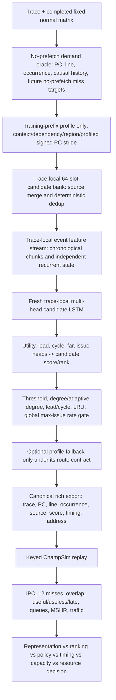
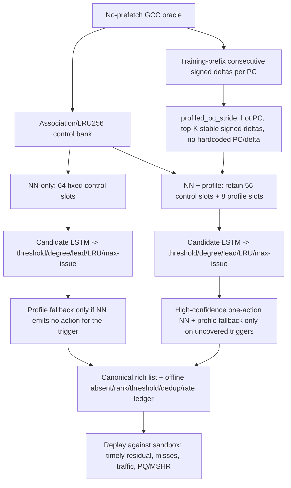
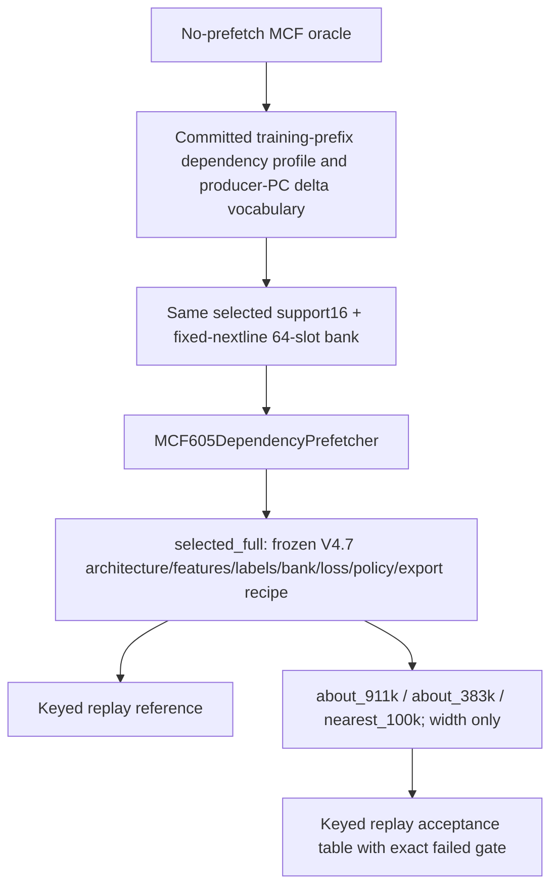
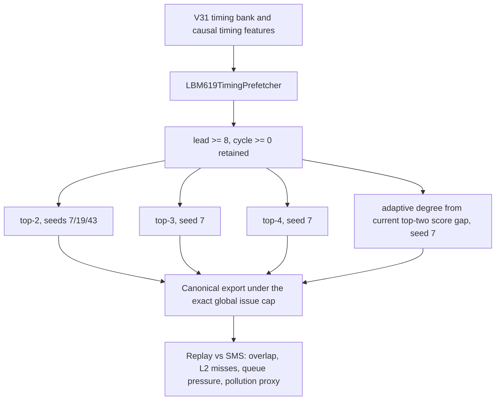
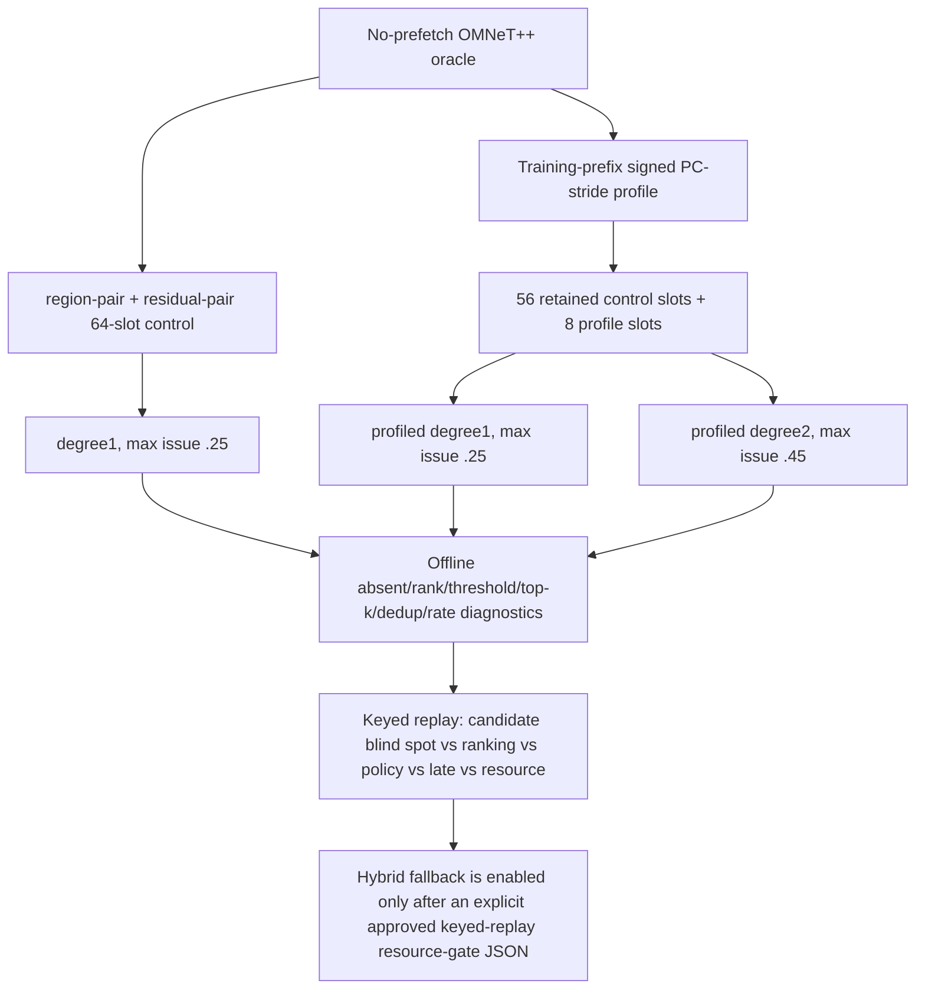
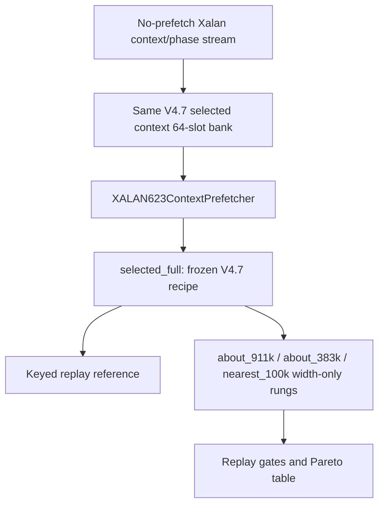

# V4.8 Final — Independent Trace-Local Neural Prefetchers on One A100

## Status and claim boundary

This is an implementable experiment protocol, not a completed performance claim. A V4.8 candidate is never described as better than a normal prefetcher from loss, selected accuracy, candidate recall, or a rich export alone. The claim boundary is a valid PC-line-occurrence keyed ChampSim replay with comparable warmup/simulation windows, fixed normal-baseline matrix, IPC, L2-miss, event-timeliness, traffic, PQ, MSHR, acceptance, rejection, and duplicate evidence.

The design follows a quantitative method:

1. State the bottleneck as a falsifiable hypothesis.
2. Freeze the baseline/window/metric contract.
3. Change one causal mechanism at a time.
4. Measure the mechanism offline, then in replay.
5. Keep or reject the mechanism from replay evidence, not narrative.

## Non-negotiable isolation contract

The single notebook is an organizer only. It owns five independent experiments:

| Trace | Independent class | V4.7 evidence anchor | Fixed normal reference | V4.8 first question |
|---|---|---:|---:|---|
| `602.gcc_s-734B` | `GCC602Prefetcher` | 0.42916 IPC | sandbox 0.43628 | Can general profiled signed PC stride and guarded fallback close residual timely coverage without harmful traffic? |
| `605.mcf_s-994B` | `MCF605DependencyPrefetcher` | 0.19146 IPC | AMPM 0.18874 | With the selected V4.7 recipe frozen, how much NN capacity is truly required? |
| `619.lbm_s-4268B` | `LBM619TimingPrefetcher` | 0.36984 IPC | SMS 0.38105 | Is degree rather than candidate reachability limiting SMS-only timely targets? |
| `620.omnetpp_s-874B` | `OMNET620RegionPrefetcher` | 0.24295 IPC | SMS 0.24695 | Are useful targets absent from the region/residual bank before any model-size change? |
| `623.xalancbmk_s-700B` | `XALAN623ContextPrefetcher` | 0.37872 IPC | SPP 0.35391 | With the selected V4.7 recipe frozen, how much NN capacity is truly required? |

Every trace has a separate model object and tensor weights, AdamW optimizer, cosine schedule, AMP scaler, chronological split, raw feature object, normalization statistics, candidate bank, profile table, LSTM state, checkpoint, policy table, ledger, export, metadata, replay plan, and artifact directory. The only shared objects are stateless implementation functions and fixed normal-reference files.

## Global experiment flow



## Common model and accounting

The deployment candidate scorer is a two-layer chronological LSTM followed by a candidate ranker:

```text
hashed causal event features + nine continuous features
  -> event embeddings + continuous projection
  -> two-layer stateful LSTM
  -> LayerNorm + context MLP
candidate delta/source/page-delta/offset embeddings
  -> candidate projection
[event context, candidate vector, elementwise product]
  -> rank MLP
  -> utility(1), lead-bin, cycle-bin, far(1), issue(1)
```

The same *family* is used for all traces, but each trace has an independent subclass and instance. V4.8 does not use a universal shared model.

| Rung | Event embedding | Candidate embedding | Continuous projection | Hidden state | Layers | Actual trainable parameters |
|---|---:|---:|---:|---:|---:|---:|
| `selected_full` | 40 | 40 | 24 | 160 | 2 | 4,147,959 |
| `about_911k` | 10 | 10 | 8 | 40 | 2 | 911,219 |
| `about_383k` | 4 | 4 | 4 | 40 | 2 | 382,549 |
| `nearest_100k` | 1 | 1 | 1 | 4 | 2 | 152,891 |

The notebook computes each count programmatically. It also reports, separately from neural parameters: profile/candidate-table bytes, candidate-bank slots, checkpoint bytes, exported row and list bytes, LRU entry storage, global issue-budget state, and fallback-profile storage. Neural parameter count is never presented as total deployable storage.

A sub-1000 parameter lower bound is intentionally not part of the main ladder because this embedding-backed family has more than 150K trainable parameters even at width one. A true sub-1000 experiment would be a separate lower-bound architecture, not a dishonest re-labeling of the selected-family compression curve.

## Causal training contract

The only training source is the no-prefetch oracle. Normal-prefetch outputs are evaluation evidence; they do not become labels, bank entries, features, or policies.

Each trace uses a chronological 80/20 split. The training prefix ends before the maximum future-label horizon; the validation suffix is never used to fit a PC profile, context table, candidate bank, normalizer, checkpoint selection, or policy source. Sequences use demand-event order with independent stateful 1024-event chunks. State resets at causal boundaries, not between arbitrary events inside a chunk.

Candidate labels mark future no-prefetch demand-miss targets. The loss is focal utility BCE + lead-bin cross-entropy + cycle-bin cross-entropy + far BCE + issue BCE + pairwise candidate ranking loss. Every trace/job owns a fresh AdamW optimizer, cosine schedule, AMP scaler, gradient clipping, and early-stopping state.

## Exact per-trace routes

### 602.gcc_s-734B — residual dynamic-next-line coverage



Routes are `nn_only`, `nn_plus_profiled_pc_stride`, `hybrid_profiled_fallback`, and `high_conf_nn_plus_classical_fallback`. The last route is genuinely high-confidence: threshold 0.97, degree 1, and a 0.25 per-demand global issue budget. Fallback uses only profile-derived signed deltas, emits at most one action, shares the NN LRU and global issue cap, and never uses trace-specific PCs or addresses.

### 605.mcf_s-994B — frozen selected recipe, Stage-B capacity



“Frozen V4.7 selected full” means frozen **recipe**, not an archived V4.7 CSV. V4.8 trains its own `selected_full_reference` before small rungs. The route remains support16 plus fixed-nextline; policy remains threshold 0.50, degree 1, lead 4, cycle 0, LRU 256, and max issue 1.0.

### 619.lbm_s-4268B — degree and seed variance



The adaptive rule is general: a large score gap emits one, a medium gap emits two, and otherwise it emits up to four. It has no PC/address allowlist.

### 620.omnetpp_s-874B — candidate-bank blind spots first



The default notebook never runs the 620 fallback merely because an environment flag is set. Enabling it requires `V48_ENABLE_620_FALLBACK=1` and an approved JSON gate containing the trace, an evidence-run identifier, and `approved: true`.

### 623.xalancbmk_s-700B — frozen selected recipe, Stage-B capacity



The policy remains threshold 0.65, degree 1, lead 4, cycle 0, LRU 128, and max issue 1.0.

## Route selection and capacity selection

For 602, 619, and 620, `route_compare` holds the split, no-prefetch oracle, label construction, export schema, replay method, and evaluation window fixed. It changes only the declared route mechanism: profile source, fallback contract, degree, or issue budget. Each route uses the selected-full parameter budget.

For 605 and 623, the requested immediate work is fixed-recipe Stage B; the architecture/route comparison table records `fixed_stage_b_no_redesign` rather than pretending an unrequested redesign occurred.

`size_only` is a separate phase. It requires an explicit replay-selected route JSON and creates the same selected-full reference plus width-only rungs. It does not silently reselect a route from offline scores.

## Stage-B acceptance gates

A smaller 605/623 model is accepted only after valid keyed replay passes every gate versus the V4.8 same-recipe selected-full reference:

| Gate | Requirement |
|---|---:|
| IPC | at least 99.5% |
| selected accuracy | at least 95% |
| event coverage | at least 95% |
| event timeliness | at least 95% |
| issue rate | at most 110% |
| PQ p95 | at most 110% |
| MSHR p95 | at most 110% |
| rejected fraction increase | at most 5 percentage points |
| duplicate fraction increase | at most 5 percentage points |

Missing replay/resource data is a rejection, not a pass. The general replay analyzer writes each exact failing predicate to `failure_reason`.

## Diagnostics and the cache-miss question

Every job writes candidate recall before policy; top-1/top-2/top-4 correct-target rank recall; selected accuracy; issue rate; canonical rich-list validation; and a normalized offline causal row with counts and percentages for candidate absent, top-k/degree filtered, threshold filtered, dedup filtered, global-rate-limit filtered, invalid/other filtering, selected targets, and selected-late label proxy.

Replay adds keyed IPC; every-normal IPC deltas; L2 loads/misses; useful/useless/late; issued/dropped/accepted/rejected/duplicates; PQ/MSHR p50/p95/max; and normal-vs-NN event overlap. The normal-versus-NN table records `both_timely`, `normal_only_timely`, `standalone_only_timely`, `both_late`, and `neither_timely` against the same no-prefetch miss event key.

High normal and NN accuracy do **not** imply equal cache misses. They may issue the same target at different trigger times, solve partly disjoint future misses, differ in LRU residency after arrival, consume different PQ/MSHR capacity, or generate different pollution/duplicate traffic. Current logs support outcome-level residency/timeliness comparison. A direct common-time comparison is marked `not_observable_without_common_prefetch_issue_timestamp` unless the logger exposes a shared PF timestamp; the analyzer does not invent it. Pollution/eviction is described as an inference from misses, useless traffic, and resource pressure unless a direct eviction field exists.

## Outputs

Each run root contains:

```text
traces/<trace>/<route>/<size>/seed_<seed>/
  model.pt, model.pt.json, metadata.json, training_history.csv
  candidate_bank.json, storage.json, policy_sweep.csv
  offline_causal_diagnostics.csv, ledger/, prefetch_list.csv

plan/
  v4_8_combined_replay_plan.csv
  v4_8_stage_b_criteria.json
  v4_8_parameter_storage_table.csv
  v4_8_offline_causal_diagnostics.csv

traces/<trace>/
  replay_plan.csv
  architecture_route_comparison_offline.csv
  route_comparison_offline.csv
  fixed_architecture_size_ablation_offline.csv
  resource_sweep_plan.csv

server/
  v4_8_combined_replay.sh
```

The server analysis writes `v4_8_all_candidate_replay_comparison.csv`, `v4_8_nn_vs_every_normal_ipc.csv`, `v4_8_route_seed_variance.csv`, `v4_8_stage_b_acceptance.csv`, `v4_8_smallest_accepted_model_by_trace.csv`, `v4_8_causal_route_decisions.csv`, and `v4_8_final_five_trace_comparison.csv`.

## Reproducibility

Colab must run top-to-bottom in a fresh runtime. The notebook preflight validates all requested model sizes with synthetic legal tensors, canonical normal/adaptive/fallback export contracts, actual inputs, Stage-B topology, and the absence of any V4.7 selected-full-list requirement before GPU training begins.

On Sacramento:

```bash
cd ~/cache
git pull --ff-only origin main
RUN_ID=v4_8_final_seed7
RUN_DIR="$PWD/formal_NN_training/artifacts/v4_8/runs/$RUN_ID/worker_00_of_01"
python3 -m py_compile formal_NN_training/scripts/23_analyze_v4_8_replay.py
bash -n "$RUN_DIR/server/v4_8_combined_replay.sh"
NORMAL_SUMMARY="$PWD/formal_NN_training/results/prefetcher_baselines/summary.csv" \
NORMAL_EVENT_ROOT="$PWD/formal_NN_training/results/prefetch_experiments/v4_7_all_candidates_replay_evidence_20260706" \
MAX_JOBS=1 nohup bash "$RUN_DIR/server/v4_8_combined_replay.sh" "$PWD" "$RUN_DIR" \
  > "$PWD/nohup_v4_8_${RUN_ID}_replay.log" 2>&1 &
echo $! > "$PWD/nohup_v4_8_${RUN_ID}_replay.pid"
```

The server-side scripts use Python standard library parsing only; no pandas/numpy import is required outside Colab.

## Lessons retained from V3.3 through V4.7

| Version lesson | Retained or rejected in V4.8 |
|---|---|
| V3.3 context-aware candidate construction | Retained as a candidate source, never as a source of validation leakage. |
| V3.5 ledger/attention work | Retained as explicit candidate-reason diagnostics; not treated as IPC evidence. |
| V3.8 AMP safety | Retained as independent per-job AMP scaler and safe low-width dimensions. |
| V3.9 keyed PC-line-occurrence replay | Retained as the transport and claim contract. |
| V4.0 timing heads | Retained for lead/cycle gating, especially 619. |
| V4.7 trace-specific bottlenecks | Retained: 602/620 representation, 619 degree/variance, 605/623 fixed-recipe size reduction. |
| Earlier tiny-model comparisons that changed bank/policy with width | Rejected as capacity evidence because they confounded mechanisms. |

## Limitations

Static compile, synthetic forward tests, export-contract tests, and script syntax checks are not substitutes for a real 25M/25M replay. Offline parameter count is not total deployable state. Replay artifact list size is not claimed as on-chip hardware storage. Event attribution establishes measured outcome classes; it does not prove a direct eviction mechanism unless the logger exposes one.
